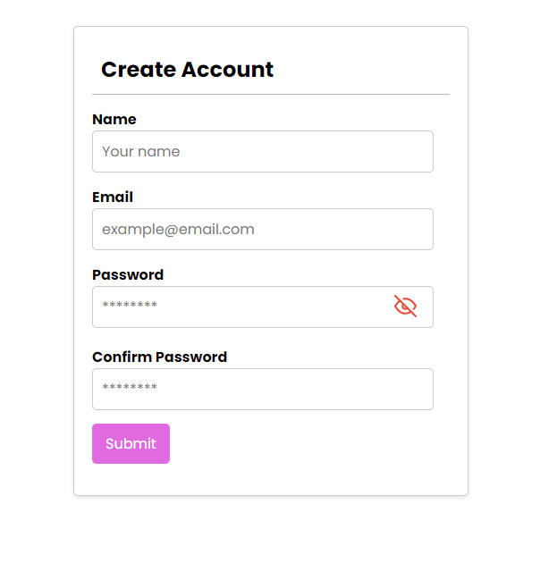
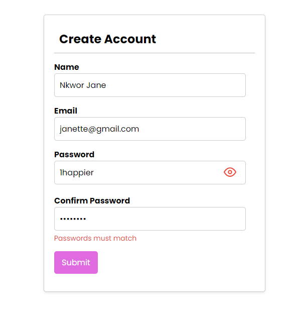

# Dynamic Form

## Overview

This project is part of the Codevixens 10 Days of Frontend Challenge (Day 2). This Dynamic Form web application was built using Vite React and styled with CSS. The task focuses on mastering  form handling, input validation, error handling and alerts in ReactJS.

## Features

- **Form Handling:** A dynamic form with 4 input fields.
- **State Management:** React's **useState**  hook were used to manage input form data and validation errors.
- **Input Validation:** Allows input validation for each of the input fields.
- **Error Handling:** Handles display of errors for invalid input fields.
- **User Interface:** Simple UI that allows user's input form data with a submit button for the form.

## Installation

1. Clone the repository: ```javascript git clone https://github.com/Nkwor-Jane/formValidation.git```

2. Navigate to the project directory: ```javascript cd formValidation```

3. Install dependencies:```javascript npm install```

## Usage

1. Start the development server: ```javascript npm run dev```

2. Open your browser and navigate to: ```javascript http://localhost:5173/```

## How it Works

1. **Input Fields:** Enter your name, Email, password and confirm password.
2. **Form Submission:** Click submit button to submit the form and get an alert for success. The **Submit** button will be disabled till you fill all the input fields.
3. **Error Messages:** If an input field is invalid, an error message will be displayed below the input field when the **submit** button is clicked.

## Screenshots

- Before input
  


- Form Validation


## Live Demo

Check out the live demo [here](https://formdynamo.netlify.app/).

## Contirbuting

Feel free to clone and fork this repository. You can also submit pull requests. Any contributions are welcome!

## License

This project is licensed under the MIT License

## Acknowledgements

- [Codevixens](https://codevixens.org/) for organizing this challenge.
- Lois Bassey, Chinaza Igboanugo, Gaelle Tiku Brenda - and Oyakinsola Shoroye for their contributions and guidance towards the successful completion of this projects.

Feel free to customize it further to fit your needs! If you have any specific details you'd like to add or change, let me know.
